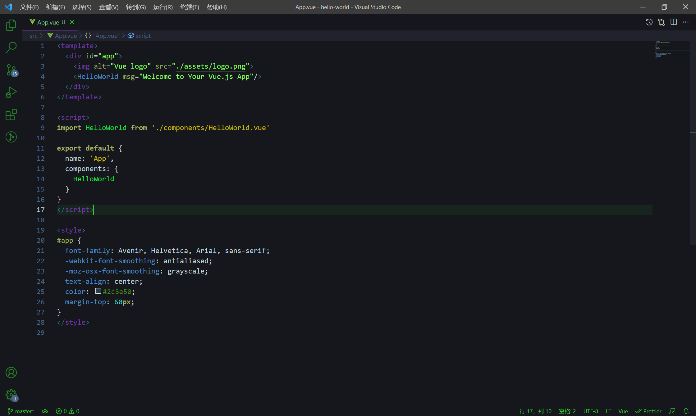
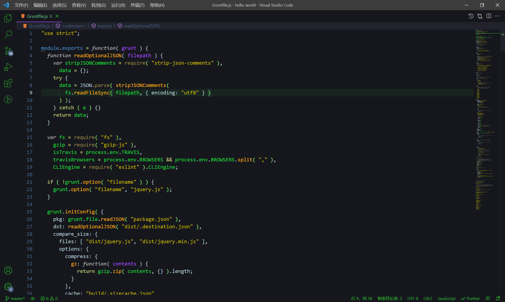
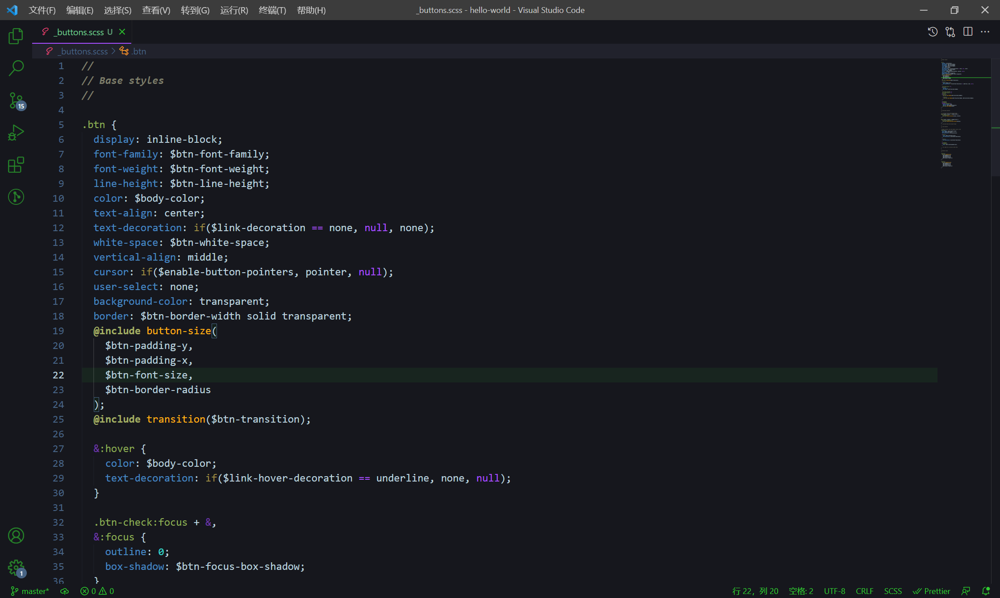

# HackElectron

HackElectron Theme for VS Code

## Previews

#### Getting started

You can install this theme through the [Visual Studio Marketplace](https://marketplace.visualstudio.com/items?itemName=TheVoidsteppers.hack-electron)

1.  Open **Extensions** sidebar panel in VS Code. `View → Extensions`
2.  Search for `HackElectron`
3.  Click **Install** to install the theme
4.  Click **Reload** to reload your editor
5.  _File > Preferences > Settings > Workbench > Color Theme >_ **HackElectron**
6.  Optional: Use the recommended settings below for best experience

## Installation via command line

    $ git clone https://github.com/TheVoidsteppers/hack-electron.git ~/.vscode/extensions/HackElectron
    $ cd ~/.vscode/extensions/HackElectron
    $ npm run build
